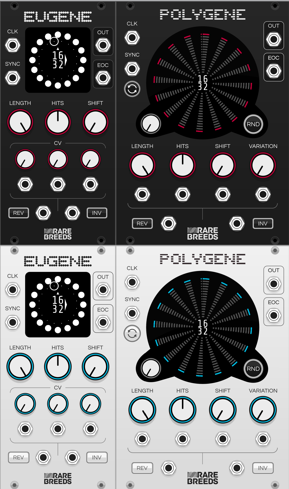
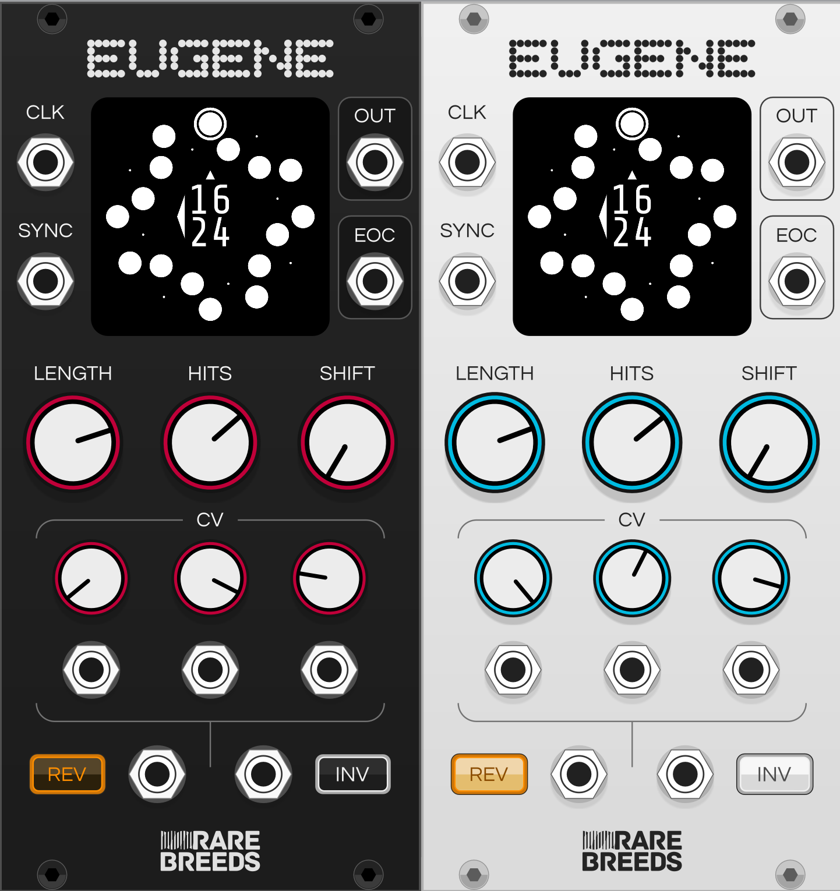
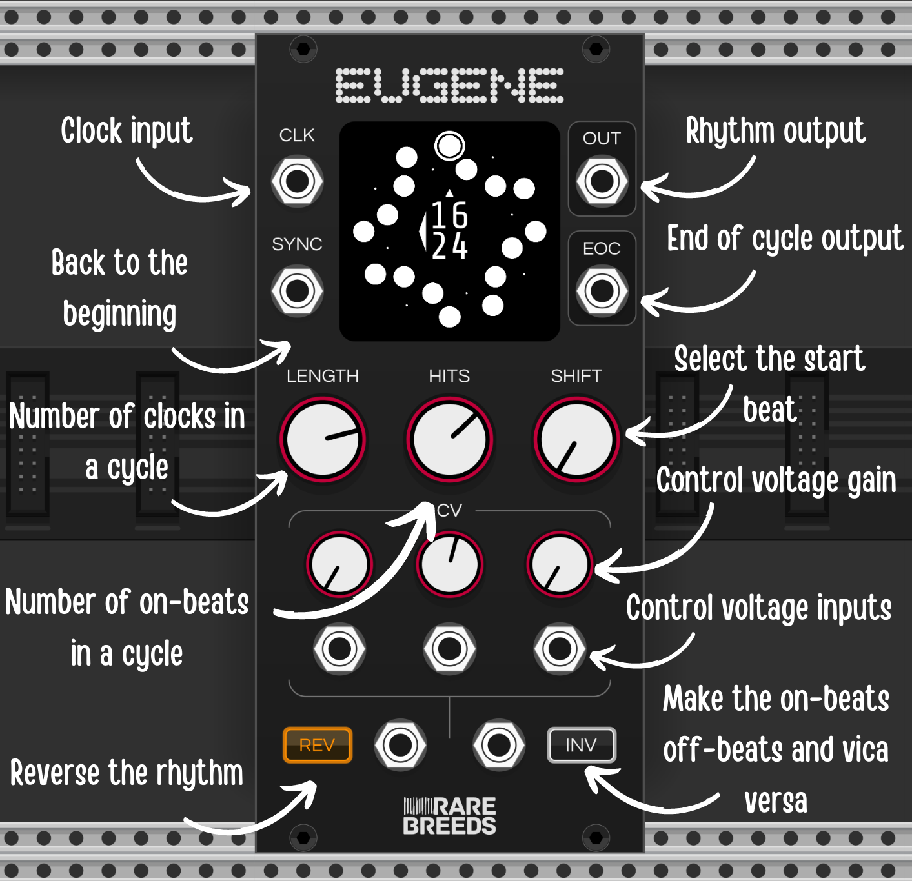
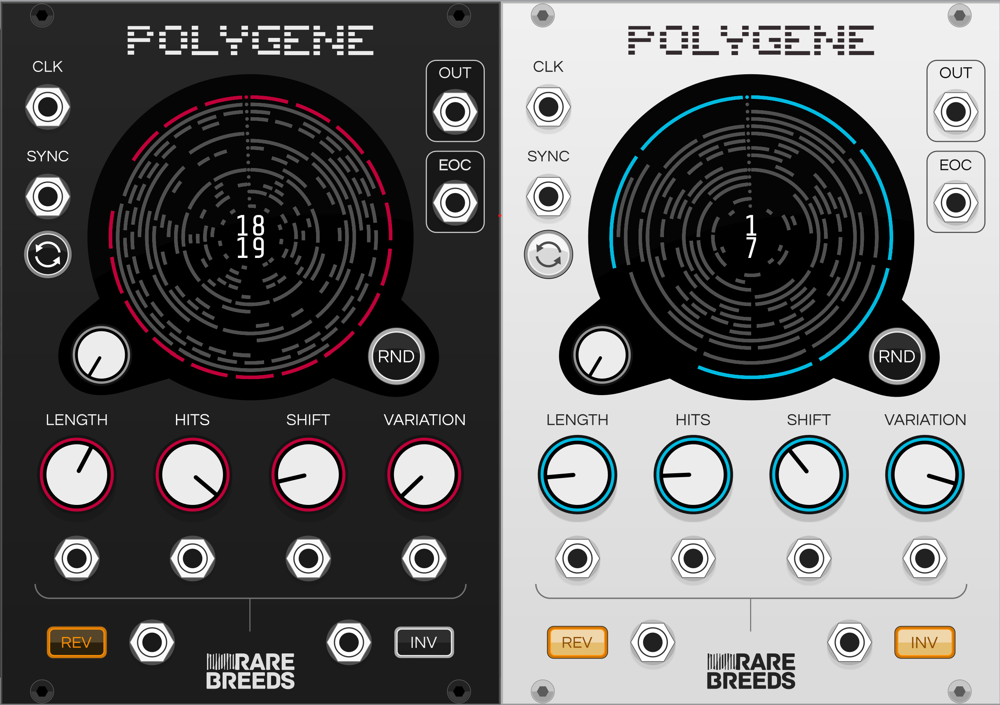
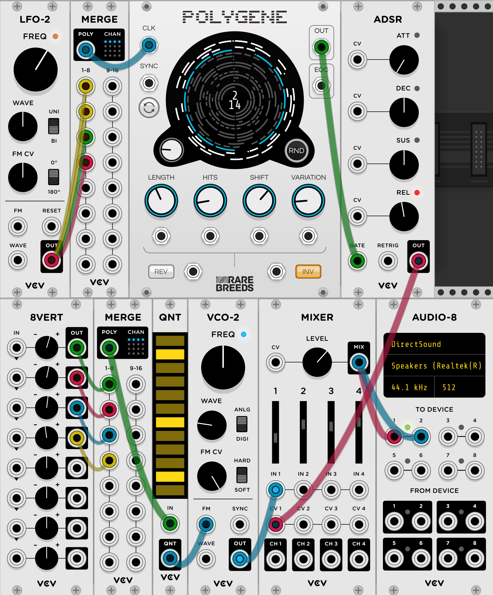

# Orbits Manual

Orbits is an [open source](https://github.com/RareBreeds/Orbits/) plugin for [VCV Rack](https://vcvrack.com/).

## Eugene

Eugene is a [Euclidean Rhythm](https://en.wikipedia.org/wiki/Euclidean_rhythm) generator module.

### Example Patch

### Specifications
 * [Euclidean Rhythms](https://en.wikipedia.org/wiki/Euclidean_rhythm) up to 32 beats long
 * Rhythms are both reversible and invertible
 * External clock input
 * Sync input for syncing the start of the rhythm with another signal
 * Shift knob for selecting the initial beat of the rhythm
 * Lots of CV controllable parameters
 * End of cycle (EOC) pulse (configurable to trigger on repeat, first or last beat)
 * 3 Beat modes that control the beat output behaviour (Unreleased \>v1.2.0)

### Panel

### Out : Output
A pulse is output when an on-beat (hit) is clocked.

0-10V Unipolar CV.

#### Unreleased (\>v1.2.0)
When the output is lowered depends on the beat mode. There's 3 behaviour options available when right clicking the module:

- Pulse - A 1ms pulse is output on each on-beat
- Gate - The output is raised on each on-beat and lowered on each off-beat, the output is retriggered for successive on-beats
- Hold - The output is raised on each on-beat and lowered on each off-beat, the output is held high for successive on-beats

### EOC : Output yes
A pulse is output when a new cycle starts.

There's 3 behaviour options available when right clicking the module:

- On Repeat - On the first beat of the new cycle, only if a cycle has been completed.
- First - On the first beat of the cycle, even if a cycle hasn't been completed.
- Last - On the last beat of the cycle.

0-10V Unipolar CV 1ms pulse duration.

### Clk : Input, Rising Edge Sensitive, Schmitt triggered
A rising edge advances the current beat.

### Sync : Input, Rising Edge Sensitive, Schmitt triggered
A rising edge resets the current beat to the first beat of the rhythm which is always 12 o'clock on the display.

### Length : Input
The number of beats in the rhythm. Integer range between 1 to 32 inclusive.

### Hits : Input
The number of on-beats in the rhythm, or the density. Integer range between 0 and the current Length inclusive.

### Shift : Input
Sets the beat in the rhythm to start from. A sync pulse will set the current beat to this number of beats before beat 0. Integer range between 0 and the current Length - 1 inclusive.

Rotating this knob has the effect of rotating the start beat the same direction around the circle.

### Reverse : Input, Level Sensitive, Schmitt triggered
Sets the direction that the clock advances the beat. Clockwise when off, anticlockwise when on.

### Invert : Input, Level Sensitive, Schmitt triggered
Inverts the Euclidean algorithm. When this switch is on on-beats become off-beats and off-beats become on-beats. Visually you can tell this is enabled by the on-beats being represented as empty circles rather than whole ones.

### CV : Input
All manually controlled inputs are also CV controllable.

Len, Hits and Shift have +-5V bipolar CV inputs with a knob for adjusting CV gain. The CV is summed with the current knob setting.

Reverse and Invert have Schmitt triggered CV inputs that override the switch settings.

## Polygene

Polygene is a polyphonic rhythm generator module.

### Example Patch

### Specifications
 * Visualisation and control of up to 16 rhythms
 * [Euclidean Rhythms](https://en.wikipedia.org/wiki/Euclidean_rhythm) up to 32 beats long
 * Rhythms are both reversible and invertible
 * Variation knob provides unique variations around the Euclidean rhythm pattern
 * External clock input
 * Sync button and CV input for syncing the start of the rhythm with another signal
 * Shift knob for selecting the initial beat of the rhythm
 * Lots of CV controllable parameters
 * End of cycle (EOC) pulse (configurable to trigger on repeat, first or last beat)
 * 3 Beat modes that control the beat output behaviour (Unreleased \>v1.2.0)

### Panel

### Clk : Input, Polyphonic, Rising Edge Sensitive, Schmitt Triggered

The number of active channels on this input sets the number of channels active on the output.

A rising edge advances the current beat for that channel.

### Sync : Input, Polyphonic, Rising Edge Sensitive, Schmitt Triggered

A rising edge on a channel resets the current beat to the first beat of the rhythm for that channel which is always 12 o'clock on the display.

Pressing the sync button syncs all channels.

### Channel Knob : Input

The channel knob selects the current active channel. The selected channel is highlighted on the display and is the channel that will be modified by any changes to the Length, Hits, Shift, Variation, Reverse or Invert manual controls.

Always ranges from 1 to 16 channels, inactive channels are greyed out and are enabled by providing a clock input on that channel.

### RND : Input

Pressing the RND button randomises the length, hits, shift, variation, invert and reverse values for the selected channel.

### Length : Input, Polyphonic

The number of beats in the rhythm. Integer range between 1 to 32 inclusive.

The voltage on the length CV input is divided by 5 and multiplied by the length knob setting for that channel to decide the final length value for a channel.

Moving the length knob changes the length setting for the currently selected channel.

### Hits : Input, Polyphonic

The number of on-beats in the rhythm, or the density. Integer range between 0 and the current Length inclusive.

The voltage on the hits CV input is divided by 5 and multipied by the hits knob setting for that channel to decide the final hits value for a channel.

Moving the hits knob changes the hits setting for the currently selected channel.

### Shift : Input, Polyphonic

Sets the beat in the rhythm to start from. A sync pulse will set the current beat to this number of beats before beat 0. Integer range between 0 and the current Length - 1 inclusive.

Rotating this knob has the effect of rotating the start beat the same direction around the circle.

The voltage on the shift CV input is divided by 5 and multiplied by the shift knob setting for that channel to decide the final shift value for a channel.

Moving the shift knob changes the shift setting for the currently selected channel.

### Variation : Input, Polyphonic

Sets the rhythm variation. When set to 0 the rhythm variation is Euclidean. As the knob is rotated clockwise the rhythm changes moving one beat by one position at a time. The variation is always unique in that it is never a duplicate or a rotation of a previous rhythm for a given length and hits.

The voltage of the variation CV input is divided by 5 and multipied by the variation knob setting for that channel to decide the final variation value for a channel.

Moving the variation knob changes the variation setting for the currently selected channel.

### Reverse : Input, Polyphonic, Level Sensitive, Schmitt Triggered

Sets the direction that the clock advances the beat. Clockwise when off, anticlockwise when on.

If the reverse CV input is connected its values are used in preference to the button settings for that channel.

### Invert : Input, Polyphonic, Level Sensitive, Schmitt Triggered

Inverts the rhythm. When this button is on on-beats become off-beats and off-beats become on-beats.

If the invert CV input is connected its values are used in preference to the button settings for that channel.

### Out : Output, Polyphonic

A pulse is output when an on-beat (hit) is clocked for that channel.

The number of output channels matches the number of channels active on the clock input.

0-10V Unipolar CV.

#### Unreleased (\>v1.2.0)
When the output is lowered depends on the beat mode. There's 3 behaviour options available when right clicking the module:

- Pulse - A 1ms pulse is output on each on-beat
- Gate - The output is raised on each on-beat and lowered on each off-beat, the output is retriggered for successive on-beats
- Hold - The output is raised on each on-beat and lowered on each off-beat, the output is held high for successive on-beats

### EOC : Output, Polyphonic
A pulse is output on each channel when a new cycle for that channel starts.

The number of output channels matches the number of channels active on the clock input.

There's 3 behaviour options available when right clicking the module:

- On Repeat - On the first beat of the new cycle, only if a cycle has been completed.
- First - On the first beat of the cycle, even if a cycle hasn't been completed.
- Last - On the last beat of the cycle.

0-10V Unipolar CV 1ms pulse duration.
