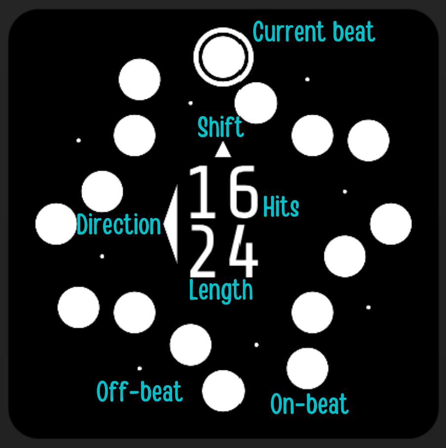

# Orbits Manual

## Eugene

Eugene is a [Euclidean Rhythm](https://en.wikipedia.org/wiki/Euclidean_rhythm) Generator plugin for [VCV Rack](https://vcvrack.com/).

### Specifications
 * [Euclidean Rhythms](https://en.wikipedia.org/wiki/Euclidean_rhythm) up to 32 beats long
 * Rhythms are both reversible and invertible
 * External clock input
 * Sync input for syncing the start of the rhythm with another signal
 * Shift knob for selecting the initial beat of the rhythm
 * Lots of CV controllable parameters

### Panel

### Out : Output
A pulse is output when an on-beat (hit) is clocked. 0-10V Unipolar CV 1ms pulse duration.

### Clk : Input
On pulse advances the current beat. Schmitt triggered.

### Sync : Input
On pulse resets the current beat to the first beat of the rhythm. Schmitt triggered.

### Len : Input
The number of beats in the rhythm. Integer range between 1 to 32 inclusive.

### Hits : Input
The number of on-beats in the rhythm, or the density. Integer range between 0 and the current Length inclusive.

### Shift : Input
Sets the beat in the rhythm to start from. A sync pulse will reset the current beat to this beat. Integer range between 0 and the current Length - 1 inclusive.

### Reverse : Input
Sets the direction that the clock advances the beat. Clockwise when Off, Anticlockwise when On.

### Invert : Input
Inverts the Euclidean algorithm. When this switch is on on-beats become off-beats and off-beats become on-beats. Visually you can tell this is enabled by the on-beats being represented as empty circles rather than whole ones.

### CV : Input
All manually controlled inputs are also CV controllable.

Len, Hits and Shift have +-5V bipolar CV inputs with a knob for adjusting CV gain. The CV is summed with the current knob setting.

Reverse and Invert have Schmitt triggered CV inputs that override the switch settings.

